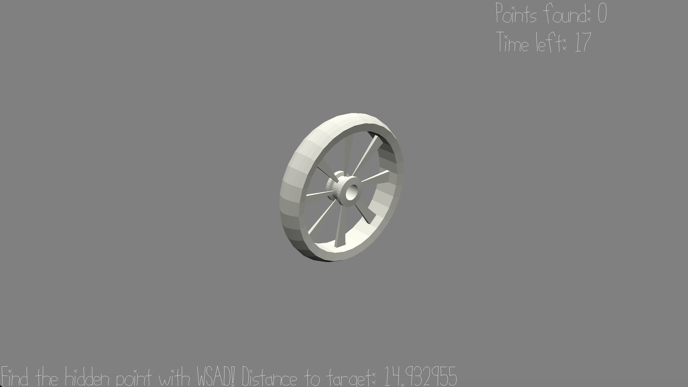

# Rolling wheel

Author: Dante Liang

Design: 
The player moves a wheel on an imaginary plane and has to figure out directions by themselves.
The goal of the game is to get to hidden points where only the relative distance is revealed to the player.

Screen Shot:

How To Play:

Control with wsad. Try to get to as many hidden points as possible before time limit.

This game was built with [NEST](NEST.md).
